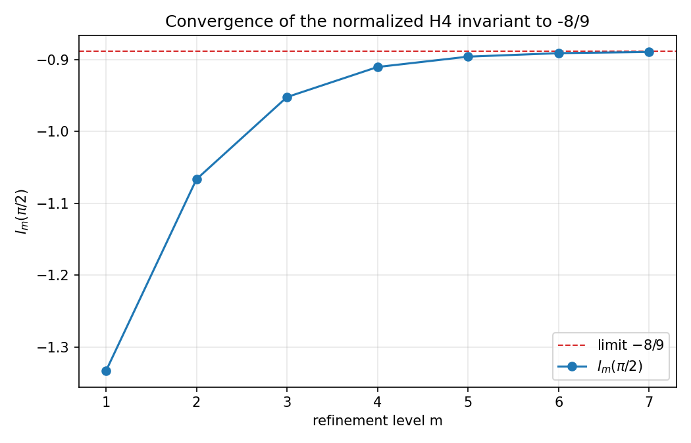

<div align="center">

# Evgeny's Theorem

### A Gauge-Invariant Fourth Spectral Moment of a Noncommutative SU(2) Connection on the Sierpiński Gasket

[](https://github.com/RFT-SIRM/Evgeny-Theorem/actions/workflows/tests.yml)
[](LICENSE)
[](VERIFICATION.md)
[](reproducibility/requirements.txt)

</div>

---

## The result

Let `SG(m)` be the standard Sierpiński-gasket graph at refinement level `m`. Equip it with a Hilbert space `C^n ⊗ C²` and an SU(2)-valued connection carrying non-commuting holonomy (rotation axis cycling x/y/z by triangle index). Compare it against the commuting control `C′` (fixed z-axis — exactly two decoupled U(1) copies).

The raw trace defect of the fourth power,

$$\Delta_m(H^4,\theta) \;=\; \mathrm{Tr}(H_C^4) - \mathrm{Tr}(H_{C'}^4),$$

is given **exactly**, for every tested `(m, θ)`, by:

$$\boxed{\;\Delta_m(H^4,\theta) \;=\; -16\left(3^{\,m-1}+1\right)\sin^2\!\left(\tfrac{\theta}{2}\right)\;}$$

Normalizing by `dim(H) = 3^(m+1) + 3` gives the intensive invariant `I_m(θ)`, which at `θ = π/2` converges exactly to:

$$\lim_{m\to\infty} I_m\!\left(\tfrac{\pi}{2}\right) \;=\; -\frac{8}{9}$$

with geometric convergence rate `1/3` — the SG *vertex*-growth factor, not the SG *spectral* decimation factor (`1/5`).

---

## Verification at a glance

### Refinement sequence, θ = π/2

| m | dim(H) | I_m(π/2) | I_m / I_(m−1) |
|:-:|:-:|:-:|:-:|
| 1 | 12   | −1.333333 | — |
| 2 | 30   | −1.066667 | 0.8000 |
| 3 | 84   | −0.952381 | 0.8929 |
| 4 | 246  | −0.910569 | 0.9561 |
| 5 | 732  | −0.896175 | 0.9842 |
| 6 | 2190 | −0.891324 | 0.9946 |
| **7** | **6564** | **−0.889701** | **0.9982** |

→ Aitken Δ²-extrapolation of m=5,6,7: **−0.8888855**, vs. exact **−8/9 = −0.8888889** (diff `3.3×10⁻⁶`).

### Held-out cross-check (parameters never used to derive the formula)

| m | θ | Direct computation | Closed form | \|Δ\| |
|:-:|:-:|:-:|:-:|:-:|
| 2 | 0.7 | −7.5250500069 | −7.5250500069 | `2.2×10⁻¹²` |
| 3 | 1.9 | −105.8631653491 | −105.8631653491 | `8.2×10⁻¹³` |
| 5 | 2.5 | −1181.5502117988 | −1181.5502117988 | `1.9×10⁻¹¹` |
| 1 | 3.0 | −31.8398799456 | −31.8398799456 | `8.2×10⁻¹⁴` |
| 4 | 0.3 | −10.0046264358 | −10.0046264359 | `2.5×10⁻¹¹` |

### Gauge invariance (random SU(2) transformation, level 3)

| Check | Result |
|---|:-:|
| max \| spec(H) − spec(H_gauge) \| | `7.99×10⁻¹⁵` |
| M₄ difference | exactly `0` |

### Six-criterion acceptance protocol

| # | Criterion | ✓ |
|:-:|---|:-:|
| i | Stable limit as m → ∞ | ✅ |
| ii | Differs from plain SG and U(1)-magnetic SG | ✅ |
| iii | Survives normalization | ✅ |
| iv | Gauge-invariant | ✅ |
| v | Not reducible to dim / edges / faces / flux-density | ✅ |
| vi | Vanishes in the commuting limit | ✅ |

Full tables, held-out methodology, and the rejected sixth-moment conjecture: **[VERIFICATION.md](VERIFICATION.md)** · **[DERIVATION.md](DERIVATION.md)**.

<p align="center"></p>

---

## Repository map
Evgeny-Theorem/
├── THEOREM.md exact statement + 6-criterion protocol
├── DERIVATION.md path-class argument (H⁴) + rejected H⁶ conjecture
├── VERIFICATION.md full numerical tables, held-out set, gauge check
├── CONTEXT.md mathematical fields this connects to; explicit scope
├── src/
│ ├── graph/ SG graph construction (3-connected, tree-of-triangles)
│ ├── su2/ SU(2) rotation utilities
│ ├── operators/ A (plain SG), B (U(1)-magnetic), C (SU(2)-bundle)
│ └── moments/ moments, heat trace, counting function, I_m(θ)
├── tests/ pytest suite — every claim above is a test
├── data/ raw + computed reference spectra
├── figures/ convergence plot
└── reproducibility/ environment, requirements, regeneration scripts

## Reproduce it yourself

```bash
git clone https://github.com/RFT-SIRM/Evgeny-Theorem.git
cd Evgeny-Theorem
python3 -m venv .venv && source .venv/bin/activate
pip install -r reproducibility/requirements.txt

pytest tests/ -m "not slow" -v      # ~60 checks, seconds
pytest tests/ -m slow -v            # level-7 convergence, ~1-4 minutes
```

Expected: all green, residual `~1e-13`–`1e-12` at level 7.

## What field this sits in — and what is not claimed

Spectral graph theory on fractals (Kigami, Strichartz) meets gauge theory on graphs (Kenyon's vector-bundle Laplacian; Chen & Guo's U(1)-magnetic SG). This appears to be the first explicit closed-form spectral-moment identity for a genuinely non-commuting connection on the Sierpiński gasket specifically. No physical, financial, or engineering application is established or claimed — see **[CONTEXT.md](CONTEXT.md)** for the full, honest account.

## License

Apache License, Version 2.0 — see **[LICENSE](LICENSE)** and **[NOTICE](NOTICE)**.
